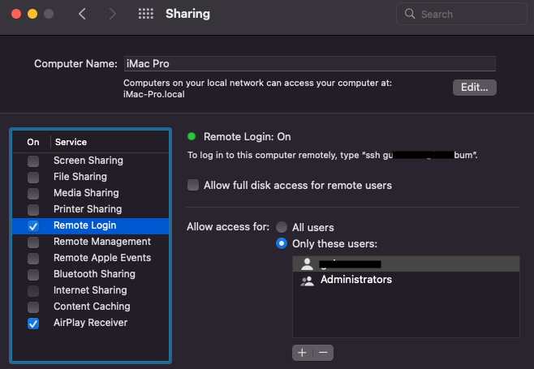
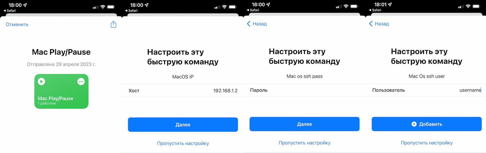

# Control MacOS Media Keys with Shortcuts

## Install
```
pip3 install pyobjc-framework-Quartz
git clone https://github.com/guinmoon/ios-macos-mediakey-shortcuts ~/ios_macos_mediakey_shortcuts
```

### Add Shortcuts
[](https://www.icloud.com/shortcuts/af41822e22a544edab5f2d9dc9d65294)
[](https://www.icloud.com/shortcuts/63ce791c99164d9bb082b169fac3bb30)
[](https://www.icloud.com/shortcuts/99751cac9a5544bdba4cb4f8041da69b)
[](https://www.icloud.com/shortcuts/65e10bcab3d743e79b939d767426c74f)

### Allow ssh access
System Preferences -> Sharing -> Remote Login


### Configure shortcut


## Python Script Usage:
```
python3 quartz_mediakey.py <parameter>

PARAMETERS:
-h help

-p play/pause
-n next
-r prev
-f fast
-w rewind

-u sound up
-d sound down
```